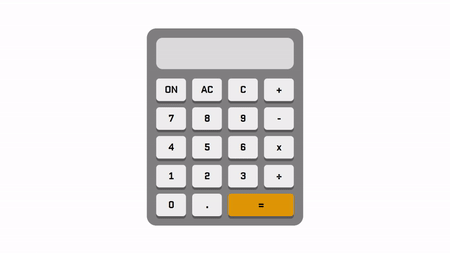

# Calculator in JavaScript

> Users can do simple calculations with this calulator (addition, subtraction, multiplication, division).

> In order to start the calculator, the _ON_ button needs to be clicked. After turning it off and turning it on again, the variables are being reset and their value is undefined by default.

> Users can also clear all the display contents or just clear the last digit of the current number.

---

### Live site: https://virag-ky.github.io/OpenGenus/calculator/

---

## Built with:

- HTML
- CSS
- JavaScript

## Demo

